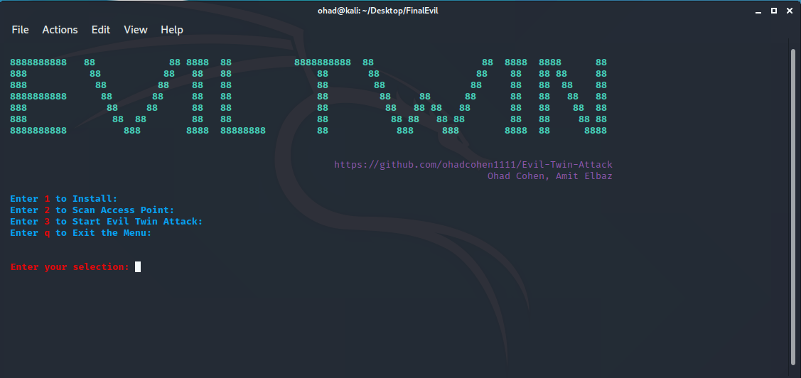
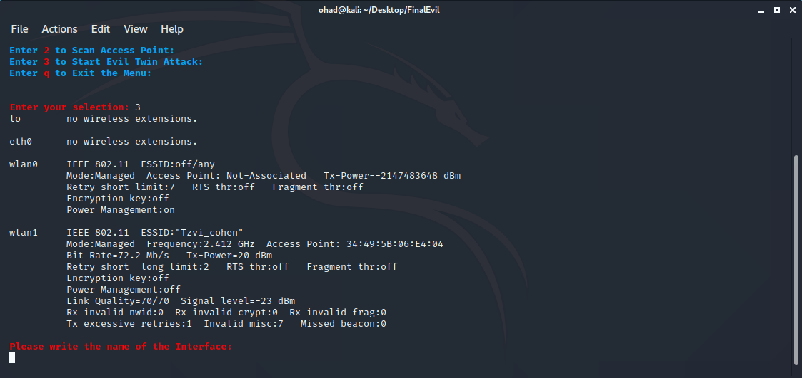
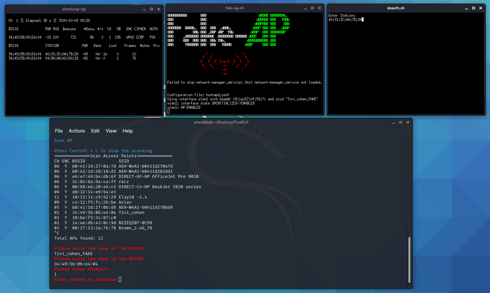
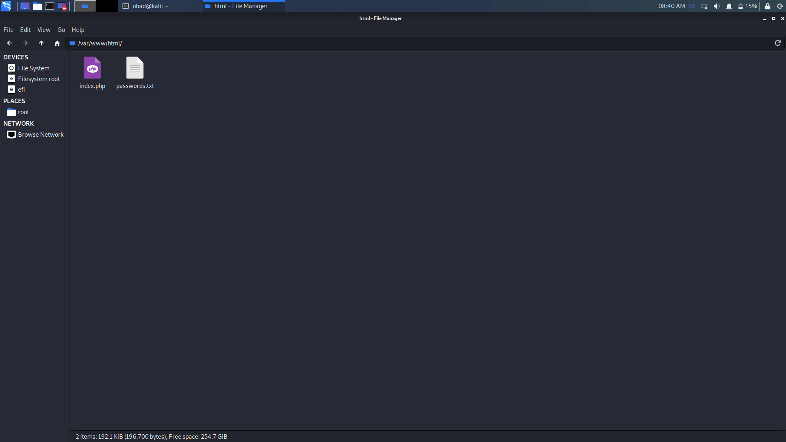

# Evil-Twin-Attack

**Introduction**  

**Requirements** 

- Kali linux system  
- Wifi adapter
- Hostapd to create the access point, so it is highly configurable.  
- Dnsmasq to run the dhcp and dns services.  
- Apache with help of dnsmasq to launch spoofed webpages as well as captive portals!  

**Installation**  

` git clone https://github.com/ohadcohen1111/Evil-Twin-Attack.git `

**Set up**  

First we need to save the website, please write in terminal  
{ sudo su  
thuna }  
It's will open a folder, Enter the folder "System operation" then Enter the  var/www/html, delete all the files in there.  
Move the file index.html, password.txt, facebook.svg to this folder.

**Usage**  

To run the program   
`./menu`  

1) Install
2) Scan Access Point  
3) Evil Twin Attack

**Photos**  
  
  
  
 
  
  
  
  
  
  
  
  
